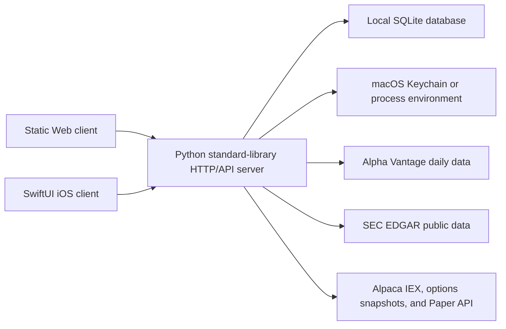

<div align="center">

# Stock Thesis Ledger

**An open-source Investment Thesis Ledger for reproducible stock research and Paper-only review.**

[English](README.md) | [简体中文](README.zh-CN.md)

Web and iOS share one private ledger, one explainable decision trail, and one
Paper-only execution boundary.

[](https://github.com/Leocs777/stock-thesis-ledger/actions/workflows/ci.yml)
[](LICENSE)
[](https://github.com/Leocs777/stock-thesis-ledger/releases/tag/v0.2.1)
[](#quick-start)
[](#safety-boundary)

</div>


<p align="center"><sub>Sanitized design preview with synthetic data. No personal portfolio or provider request is loaded.</sub></p>

> [!IMPORTANT]
> Stock Thesis Ledger is research and paper-trading software, not investment, legal,
> tax, or accounting advice. Outputs are deterministic scenarios for inspection,
> not promises, forecasts, or instructions to buy or sell. Read the full
> [disclaimer](DISCLAIMER.md).

## Why this project

| Local-first | Explainable | Cross-platform | Paper-only |
| --- | --- | --- | --- |
| One Python process and SQLite database on a machine you control | Every score retains its inputs, evidence, counter-evidence, and invalidation rules | Responsive Web workspace plus a native SwiftUI iOS companion | Broker mutations are fixed to Alpaca Paper; no live-account route exists |

Stock Thesis Ledger runs without an LLM, cloud database, paid application backend, or
third-party Python runtime package. Optional providers add market and filing
evidence; the journal, worksheets, sync, and paper ledger remain local.

**Start here:** [Run it locally](#quick-start) · [Tour the product](#product-tour) ·
[Open the bilingual project site](https://leocs777.github.io/stock-thesis-ledger/) ·
[Read the strategy methodology](docs/strategy-methodology.md) ·
[Run a Paper validation campaign](docs/paper-validation-protocol.md) ·
[Understand the safety model](#safety-boundary)

The repository name makes the stock-research scope explicit. Inside the product,
**Investment Thesis Ledger** names the core workflow. The compatible Web/iOS
runtime name remains **Investor Lab**, so bundle identifiers, SQLite filenames,
environment variables, Keychain services, and Xcode paths retain that name.

Latest changes: [CHANGELOG.md](CHANGELOG.md) ·
[all releases](https://github.com/Leocs777/stock-thesis-ledger/releases)

## What it includes

- Reproducible stock research from cached daily prices and public SEC filings,
  including factor scores, evidence, invalidation conditions, scenario price
  levels, and decision history.
- A synchronized watchlist, append-only paper ledger, journal, price alerts,
  portfolio exposure, stress scenarios, and review statistics.
- Options worksheets for one-to-six-leg payoff scenarios, chain filters,
  indicative Greeks, expiration attention, and paper-plan reviews.
- Day-trade planning with user-defined risk limits, VWAP/opening-range
  observations, no-trade conditions, session replay, and execution review.
- Separate equity and option lots throughout portfolio calculations, including
  option contract multipliers, account/sector exposure, and Paper notional.
- Alpaca Paper balance, position, order, and fill mirroring, with Paper-order
  actions behind explicit acknowledgements and risk checks.

## Product tour

### Portfolio and research workspace


The Web workspace brings strategy versions, SEC fundamentals, data-quality
states, paper exposure, alerts, and an append-only decision history into one
review surface.

<table>
  <tr>
    <td width="50%"></td>
    <td width="50%"></td>
  </tr>
  <tr>
    <td><strong>Day Trade planning</strong><br>Define the exit, risk capacity, and no-trade conditions before the entry. Replay and review remain paper-only.</td>
    <td><strong>Options laboratory</strong><br>Inspect indicative chains, liquidity, Greeks, and one-to-six-leg expiration payoff scenarios.</td>
  </tr>
</table>

### Native iOS companion

<p align="center">
  
</p>

The iOS app uses the same authenticated account and incremental revision cursor.
It keeps the bearer token in device-only Keychain storage and adds local review,
filing-change, and option-expiration notifications.

## Architecture



The application is intentionally a local modular monolith:

| Layer | Implementation | Responsibility |
| --- | --- | --- |
| Server | Python 3.10+ standard library | HTTP, auth, sync, calculations, provider adapters |
| Storage | SQLite | Local accounts, paper ledger, caches, decisions, backups |
| Web | HTML, CSS, vanilla JavaScript | Responsive research and planning workspace |
| iOS | SwiftUI, iOS 17+ | Native synchronized mobile client and local notifications |
| Secrets | macOS Keychain or environment | Alpha Vantage and Alpaca credentials |

Read [Architecture](docs/architecture.md) for boundaries and data flow, and
[Accounts and sync](docs/accounts-and-sync.md) for the schema and session model.

## Quick start

### Requirements

- Python 3.10 or newer
- macOS for Keychain integration and iOS development
- Xcode 15 or newer to build the iOS 17+ client

Linux can run the local Web server with environment-based provider credentials.
The iOS project and macOS Keychain integration require Apple tooling.

### Bootstrap

```bash
git clone https://github.com/Leocs777/stock-thesis-ledger.git
cd stock-thesis-ledger
./setup.sh
python3 app.py
```

Open [http://127.0.0.1:8000](http://127.0.0.1:8000), create the first local
account, and keep the terminal running. Additional registration is disabled
after that first account unless explicitly enabled for a controlled test.

`setup.sh` installs nothing. It verifies the local toolchain, creates the
ignored `data/` directory, checks Python and configuration syntax, validates
local documentation links, and prints the run commands.

### Design-only preview

These pages do not read account or investment data:

- [http://127.0.0.1:8000/?design-preview=1](http://127.0.0.1:8000/?design-preview=1)
- [http://127.0.0.1:8000/design-system](http://127.0.0.1:8000/design-system)

### Synthetic example

Read [`examples/synthetic-decision-v4.1.json`](examples/synthetic-decision-v4.1.json)
to inspect a compact, fabricated decision record without creating an account or
configuring a provider. Its prices, ticker, returns, and dates are demonstrative
only and are not historical performance.

## Data sources and costs

| Source | Account required | Used for |
| --- | --- | --- |
| [SEC EDGAR](https://www.sec.gov/search-filings/edgar-application-programming-interfaces) | No | Company facts, submissions, and filing links |
| [Alpha Vantage](https://www.alphavantage.co/documentation/) | API key | Cached daily prices and earnings calendar |
| [Alpaca](https://docs.alpaca.markets/) | Account/API keys | IEX observations, indicative options data, Paper account/order workflows |
| [Nasdaq Trader](https://www.nasdaqtrader.com/trader.aspx?id=TradeHalts) | No | Current trading-halt feed |

Free tiers, request limits, data coverage, terms, and redistribution rights can
change. Verify each provider's current agreement before public or commercial
deployment. SEC asks automated clients to identify themselves and use fair
access practices; Stock Thesis Ledger caches SEC reads for 24 hours.

Python, SQLite, the Web client, and local calculations have no recurring
application-infrastructure fee. Apple Developer membership, authenticated HTTPS
tunnels, market-data plans, display or redistribution licenses, hosting,
monitoring, and legal review may add cost.

## Configuration

The app reads the **process environment** and does not automatically load a
`.env` file. Never commit real values.

```bash
INVESTORLAB_SEC_CONTACT=you@example.com \
ALPHAVANTAGE_API_KEY=replace_me \
python3 app.py
```

| Variable | Default | Purpose |
| --- | --- | --- |
| `INVESTORLAB_DB` | `data/investor-lab.sqlite3` | Local SQLite path |
| `INVESTORLAB_HOST` | `127.0.0.1` | Bind address |
| `INVESTORLAB_PORT` | `8000` | HTTP port |
| `INVESTORLAB_SEC_CONTACT` | signed-in email | SEC EDGAR contact |
| `ALPHAVANTAGE_API_KEY` | empty | Optional daily-price and earnings data |
| `ALPACA_API_KEY_ID` | empty | Optional Alpaca market/Paper credential ID |
| `ALPACA_API_SECRET_KEY` | empty | Optional Alpaca market/Paper secret |

See [Configuration reference](docs/configuration.md) for every supported setting,
safe defaults, HTTPS gateway controls, collection limits, and history depth.

## iOS

1. Start the local server.
2. Open `ios/InvestorLab.xcodeproj` in Xcode.
3. Select your own Apple Developer team and bundle identifier.
4. Run the `InvestorLab` scheme on an iOS 17+ Simulator.

The Simulator defaults to `http://127.0.0.1:8000`. The checked-in project has
no Apple Development Team ID.

A physical iPhone needs an authenticated HTTPS route to the local server. Enter
that HTTPS URL on the sign-in screen and start the server with a non-loopback
bind only when the tunnel requires it:

```bash
INVESTORLAB_HOST=0.0.0.0 \
INVESTORLAB_SECURE_COOKIE=1 \
INVESTORLAB_PUBLIC_URL=https://your-authenticated-tunnel.example \
python3 app.py
```

Plain HTTP on a shared network can expose a bearer token in transit. The
LaunchAgent templates under `scripts/` contain placeholders only; keep
machine-specific copies and tunnel credentials outside the repository.

See [Release readiness](docs/release-readiness.md) before building a TestFlight
archive.

Freeze and inspect a forward Paper-validation campaign from the command line:

```bash
python3 scripts/paper_validation.py freeze
python3 scripts/paper_validation.py status
python3 scripts/paper_validation.py report
```

## Safety boundary

- The brokerage host is fixed to `paper-api.alpaca.markets`; no live-account
  brokerage host or real-money order route is implemented.
- Provider credentials are never returned to Web or iOS clients. On macOS they
  can be stored in Keychain; process environment variables are the portable
  alternative.
- The server binds to `127.0.0.1` by default. Do not expose the development
  server directly to the public internet.
- Local databases, backups, logs, credentials, signing material, and build
  products are ignored by Git.

Read [Security and threat model](docs/security-and-threat-model.md) before
changing authentication, networking, secret storage, or broker code.

## Test and validate

```bash
python3 scripts/check_api_contract.py
python3 -m unittest -v
python3 -m compileall -q app.py test_app.py test_paper_validation.py test_phase2.py investor_lab scripts
python3 scripts/check-local-links.py
zsh -n setup.sh scripts/archive-testflight.sh scripts/check-testflight-readiness.sh scripts/reload-local-service.sh
plutil -lint ios/InvestorLab/Info.plist ios/InvestorLab/PrivacyInfo.xcprivacy ios/ExportOptions.plist \
  scripts/org.investorlab.server.plist scripts/org.investorlab.tunnel.plist
```

Encrypted offsite backup and read-only recovery-drill commands are documented
in [Phase 2 operations](docs/phase-2-operations.md). The passphrase stays in
macOS Keychain and is never accepted as a command-line argument.

For a signing-free Simulator build on macOS:

```bash
xcodebuild \
  -project ios/InvestorLab.xcodeproj \
  -scheme InvestorLab \
  -sdk iphonesimulator \
  -derivedDataPath /tmp/stock-thesis-ledger-derived-data \
  CODE_SIGNING_ALLOWED=NO \
  build
```

Network-provider behavior is tested with local fakes. Unit tests do not require
real provider credentials.

## Current limitations

- This is a local-first reference implementation. Controlled additional local
  accounts are supported, but it is not a hardened hosted multi-tenant service.
- Daily Alpha Vantage data and IEX observations are not consolidated real-time
  market data. Every screen must be read with its displayed timestamp and source.
- Options snapshots are indicative. Calculated Greeks and payoff diagrams are
  models, not executable quotes.
- Intraday replay uses only locally retained observations and may contain gaps.
- Backtests and outcome validation are historical simulations; they do not
  establish future performance.
- Browser notifications require the page to be open. iOS reminders are local;
  APNs background push is not implemented.
- Rules affecting day trading and broker margin treatment change. Confirm the
  current method with your broker and review current [FINRA guidance](https://www.finra.org/investors/investing/investment-products/stocks/day-trading).

## Documentation

- [简体中文项目说明](README.zh-CN.md)
- [Changelog](CHANGELOG.md)
- [Architecture](docs/architecture.md)
- [Strategy methodology](docs/strategy-methodology.md)
- [Paper validation protocol](docs/paper-validation-protocol.md)
- [Security and threat model](docs/security-and-threat-model.md)
- [Accounts and sync](docs/accounts-and-sync.md)
- [Component contracts](docs/component-contracts.md)
- [Release readiness](docs/release-readiness.md)
- [App Store privacy and TestFlight metadata](docs/app-store-privacy.md)
- [Historical product architecture notes (Chinese)](docs/stock-investment-app-architecture.md)
- [Figma local handoff](docs/figma-phase2-local-handoff.md)

## Contributing

Contributions are welcome. Start with [CONTRIBUTING.md](CONTRIBUTING.md), follow
the [Code of Conduct](CODE_OF_CONDUCT.md), and report vulnerabilities through
the private process in [SECURITY.md](SECURITY.md).

## License

Stock Thesis Ledger is licensed under the [GNU Affero General Public License v3.0
only](LICENSE). If you run a modified version for users over a network, review
the corresponding-source obligations in AGPL section 13.
