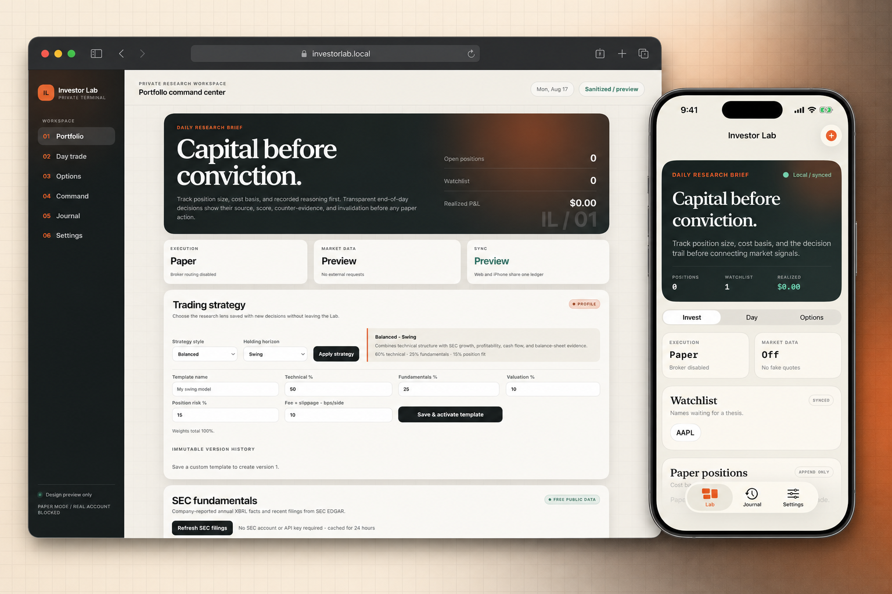
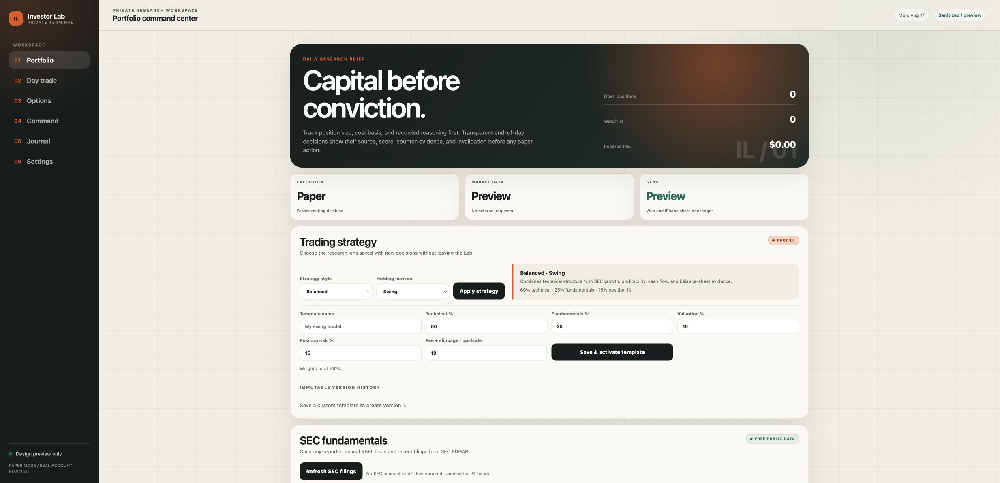
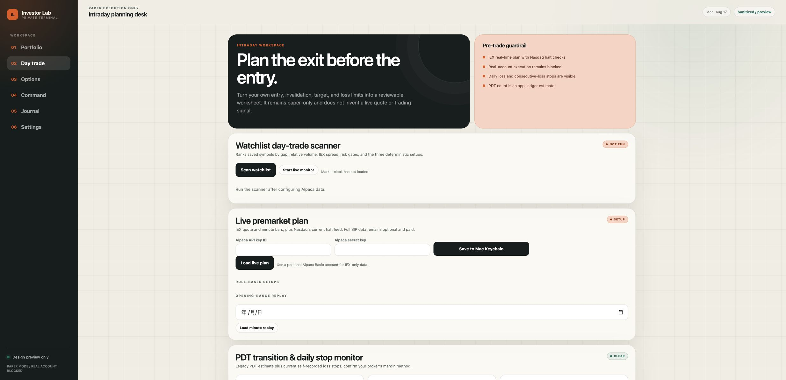
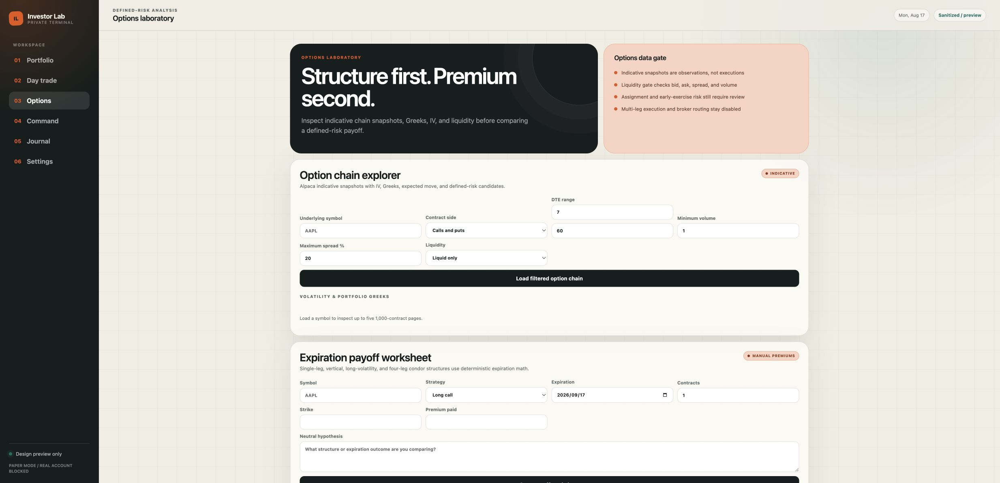
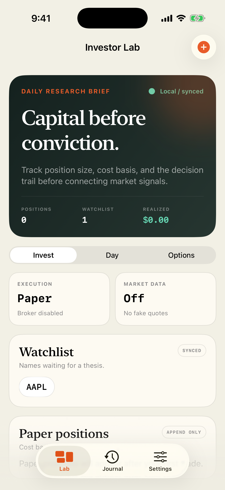
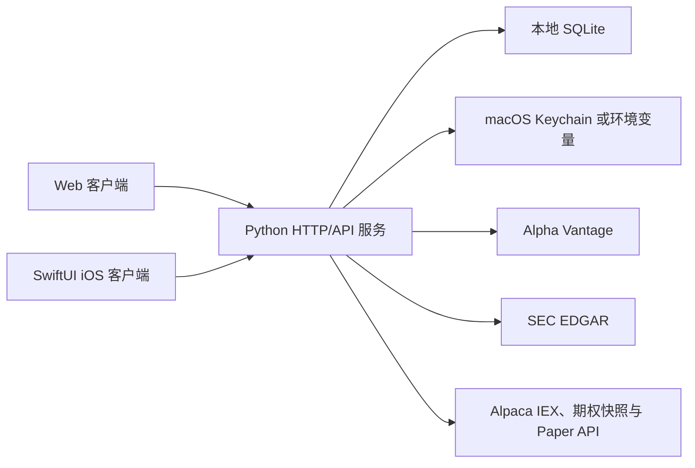

<div align="center">

# Stock Thesis Ledger

**开源、本地优先、可复核的股票研究与模拟交易台账。**

[English](README.md) | [简体中文](README.zh-CN.md)

[](https://github.com/Leocs777/stock-thesis-ledger/actions/workflows/ci.yml)
[](LICENSE)
[](CHANGELOG.md)
[](#快速开始)
[](#安全边界)

</div>



<p align="center"><sub>图片使用合成数据，不包含个人持仓、账户或数据服务商请求。</sub></p>

> [!IMPORTANT]
> 本项目用于研究、教育、软件测试和模拟交易，不提供投资、法律、税务或会计建议。
> “买入候选”“观察”“减仓”“目标价”和“止损”等都是由公开规则计算的标签或情景价位，
> 不是收益承诺、价格预测或交易指令。请阅读[完整中文免责声明](DISCLAIMER.zh-CN.md)。

## 项目定位

Stock Thesis Ledger 把一次投资判断保存为可复核的记录：输入数据、策略版本、支持证据、
反面证据、失效条件、计划价位和后续结果都保留在同一条历史中。Web 和原生 iOS 客户端
连接同一个本地 Python 服务和 SQLite 数据库，因此自选股、研究记录、模拟持仓与复盘状态
可以同步。

| 本地优先 | 逻辑透明 | Web + iOS | 仅限 Paper |
| --- | --- | --- | --- |
| 数据库和服务运行在自己控制的电脑上 | 每个分数保留输入、规则和模型版本 | 响应式网页与 SwiftUI 客户端共享台账 | 券商写操作固定到 Alpaca Paper，没有真实资金路由 |

项目不依赖 LLM、云数据库或第三方 Python 运行时包。没有配置行情服务时，账户、台账、
工作表和本地计算仍可使用；可选数据源用于补充市场和 SEC 证据。

## v0.1.6 更新

- 股票与期权持仓分开核算，并统一采用每张期权合约 100 股的乘数计算成本、市值、权重、
  行业暴露和 Paper 订单名义金额。
- 期权情景保存报价到期日和计算版本；生成的研究报告会注明计算版本。
- 日内交易 VWAP 与相对成交量只使用美东常规交易时段内、截至同一分钟的可比数据，
  并使用纽约交易日和市场时钟控制回放窗口。
- Web/iOS 会话绑定到客户端类型和设备；支持修改密码、退出所有设备、强化登录限速。
- 第一个账户成为本地保险库所有者；数据源、Paper 券商、备份、恢复和系统维护等共享控制
  仅对所有者开放。
- 提升中文覆盖、键盘焦点、弱文字对比度和非颜色风险提示；Web 与 iOS 的可恢复请求失败
  不再误清除登录状态。

完整历史见 [CHANGELOG.md](CHANGELOG.md)。

## 功能概览

### 股票研究与投资论点

- 基于缓存日线、SEC EDGAR 公司事实与文件的可重复研究。
- Strategy Lab 4.1 使用技术面、基本面、估值和持仓适配度形成 0–100 分，并保存规则阈值、
  证据、反面证据和失效条件。
- 输出回调买入区、突破触发价、风险止损参考和两个卖出目标；这些价位独立于评分，属于
  机械情景而非预测。
- 自定义策略模板采用不可变版本和配置哈希；历史判断始终关联当时的完整配置。
- 点时回测、SPY 对照、成本/滑点假设、参数敏感性和后续目标/止损验证。

### 投资组合与台账

- 自选股一键全部刷新和单个 ticker 刷新，显示观测价格、时间和数据源。
- 追加式股票/期权模拟交易台账、CSV 持仓预览导入、盈亏、现金和账户价值。
- 单一持仓与行业权重、相关性、压力情景、行动队列和再平衡计算器。
- 日记、价格提醒、决策历史、工作表复盘与可导出的本地账户备份。

### 期权实验室

- 指示性期权链、成交量/价差/DTE 筛选、IV 期限结构、微笑、25-delta 偏斜和持仓 Greeks。
- 支持 1–6 腿到期损益情景，以及 long call/put、垂直价差、straddle、strangle 和 iron condor
  工作表。
- 显示最大盈利、最大亏损、盈亏平衡点和到期提醒；报价不是可执行报价。

### 日内交易实验室

- 入场、止损、目标、单笔风险、当日亏损上限、最大仓位和最低盈亏比规划。
- Alpaca Basic 可提供 IEX 观测、盘前区间、开盘区间、常规时段 VWAP/RVOL 和市场时钟。
- Opening-range breakout、VWAP pullback 与 premarket momentum 的机械筛选、提醒和回放。
- 保存实际模拟入场/出场、偏差、R 倍数、纪律评分和复盘图。

### 账户与同步

- 浏览器使用 HttpOnly、SameSite=Strict Cookie 与 CSRF；iOS token 保存在仅本机可解锁的
  Keychain 项目中。
- Web/iOS 通过按用户隔离的增量 revision cursor 同步；密码、token 与数据源密钥不进入同步。
- 设备管理、修改密码、退出所有设备、账户导出、数据库健康检查和已验证本地备份。

## 产品界面



<table>
  <tr>
    <td width="50%"></td>
    <td width="50%"></td>
  </tr>
  <tr>
    <td><strong>日内交易</strong><br>先定义风险和不交易条件，再考虑模拟入场。</td>
    <td><strong>期权实验室</strong><br>检查流动性、Greeks 和多腿到期损益。</td>
  </tr>
</table>

<p align="center">
  
</p>

## 架构



这是一个有清晰模块边界的本地单体应用：Python 标准库负责 HTTP、认证、同步、计算和数据源
适配；SQLite 是本地记录系统；Web 使用原生 HTML/CSS/JavaScript；iOS 使用 SwiftUI。
服务器拥有最终计算和写入校验，避免两端实现不同的金融规则。详见
[架构说明](docs/architecture.md)与[账户和同步协议](docs/accounts-and-sync.md)。

## 快速开始

### 环境要求

- Python 3.10 或更高版本
- macOS（使用 Keychain 和开发 iOS 时需要）
- Xcode 15 或更高版本（构建 iOS 17+ 客户端时需要）

```bash
git clone https://github.com/Leocs777/stock-thesis-ledger.git
cd stock-thesis-ledger
./setup.sh
python3 app.py
```

打开 [http://127.0.0.1:8000](http://127.0.0.1:8000)，创建第一个本地账户，并保持终端运行。
第一个账户创建后，额外注册默认关闭。`setup.sh` 不安装任何依赖，只检查本地工具、语法、
文档链接与 plist。

无账户的设计预览：

- [http://127.0.0.1:8000/?design-preview=1](http://127.0.0.1:8000/?design-preview=1)
- [http://127.0.0.1:8000/design-system](http://127.0.0.1:8000/design-system)

## 数据源与成本

| 数据源 | 是否需要账户 | 用途 |
| --- | --- | --- |
| SEC EDGAR | 不需要 | 公司事实、提交记录和文件链接；请求需提供联系邮箱 |
| Alpha Vantage | API key | 缓存日线和业绩日历 |
| Alpaca | 账户/API key | IEX 观测、指示性期权数据、Paper 账户和订单 |
| Nasdaq Trader | 不需要 | 当前停牌信息 |

本地 Python、SQLite、Web 与计算本身没有持续应用基础设施费用。Apple Developer、HTTPS
隧道、行情套餐、数据展示/再分发许可、托管、监控和法律审查可能产生费用。服务商免费层、
配额和协议会变化，公开或商业部署前应重新核对。SEC EDGAR 的只读数据不要求注册 EDGAR
账户，但自动请求需要声明可联系的 User-Agent。

## 配置

应用读取进程环境变量，不会自动加载 `.env` 文件。[`.env.example`](.env.example) 只是
安全配置参考。常用设置：

| 变量 | 默认值 | 作用 |
| --- | --- | --- |
| `INVESTORLAB_DB` | `data/investor-lab.sqlite3` | SQLite 路径 |
| `INVESTORLAB_HOST` | `127.0.0.1` | 监听地址 |
| `INVESTORLAB_PORT` | `8000` | HTTP 端口 |
| `INVESTORLAB_ALLOW_REGISTRATION` | `0` | 是否允许第一个账户后的注册 |
| `INVESTORLAB_SECURE_COOKIE` | `0` | HTTPS 时设为 `1` |
| `INVESTORLAB_PUBLIC_URL` | 空 | 提供给客户端的 HTTPS 地址 |
| `INVESTORLAB_SEC_CONTACT` | 登录邮箱 | SEC EDGAR 请求联系地址 |
| `ALPHAVANTAGE_API_KEY` | 空 | 可选日线/业绩数据 key |
| `ALPACA_API_KEY_ID` | 空 | 可选 Alpaca Market/Paper key |
| `ALPACA_API_SECRET_KEY` | 空 | 可选 Alpaca Market/Paper secret |

不要提交真实值。macOS 交互设置可把数据源凭证保存在 Keychain；数据库、备份、日志、签名
材料与构建产物都已加入 Git 忽略规则。

## iOS 使用

1. 启动本地 Python 服务。
2. 在 Xcode 打开 `ios/InvestorLab.xcodeproj`。
3. 选择自己的 Apple Developer Team 和 bundle identifier。
4. 在 iOS 17+ Simulator 运行 `InvestorLab` scheme。

模拟器默认使用 `http://127.0.0.1:8000`。公开仓库不包含 Apple Team ID。真机登录页不会预填
任何私人服务器地址，必须填写通往本地服务的、经过认证的 HTTPS 地址。不要把 Python 开发
服务器直接暴露到公网；详见[安全与威胁模型](docs/security-and-threat-model.md)。

## 安全边界

- 所有券商写操作固定到 `paper-api.alpaca.markets`；代码中没有 live-account 路由。
- Paper 订单仍需要显式勾选确认、同步账户检查、本地名义金额/亏损限制和幂等 client ID。
- 数据源密钥不会返回 Web/iOS，也不会写入 SQLite、同步事件或账户导出。
- 本地 SQLite、JSON 导出和备份没有应用层加密，应启用 FileVault 并保护备份。
- 直接将开发服务绑定到公网不等于完成生产部署。多用户公开服务还需要托管 HTTPS、账户
  恢复/MFA、限流、集中密钥管理、加密异地备份、监控、数据许可和独立安全审查。

## 测试

```bash
python3 -m unittest -v
python3 -m py_compile app.py test_app.py investor_lab/portfolio_math.py
python3 scripts/check-local-links.py
zsh -n setup.sh scripts/archive-testflight.sh scripts/reload-local-service.sh
```

macOS 上可运行无签名模拟器构建：

```bash
xcodebuild \
  -project ios/InvestorLab.xcodeproj \
  -scheme InvestorLab \
  -sdk iphonesimulator \
  -derivedDataPath /tmp/stock-thesis-ledger-derived-data \
  CODE_SIGNING_ALLOWED=NO \
  build
```

单元测试使用本地假数据，不需要真实 API key。

## 已知限制

- 这是本地优先的参考实现，不是可直接托管的生产级多租户服务。
- Alpha Vantage 日线和 Alpaca IEX 观测不是 consolidated real-time market data；必须结合
  页面上的时间戳和来源阅读。
- 期权快照、Greeks 与损益图是指示性模型，不是可执行报价。
- 日内回放只使用本地保留的数据，可能存在缺口。
- 回测和模拟结果不代表未来表现，也可能受到样本、缺失数据、滑点和公司行动影响。
- 浏览器通知要求页面保持打开；iOS 当前使用本地通知，没有 APNs 后台推送服务。

## 文档与参与

- [策略方法](docs/strategy-methodology.md)
- [Paper 验证协议](docs/paper-validation-protocol.md)
- [安全与威胁模型](docs/security-and-threat-model.md)
- [发布准备](docs/release-readiness.md)
- [贡献指南](CONTRIBUTING.md)
- [安全问题报告](SECURITY.md)
- [英文免责声明](DISCLAIMER.md) / [中文免责声明](DISCLAIMER.zh-CN.md)

项目使用 [GNU Affero General Public License v3.0 only](LICENSE)。如果通过网络向用户提供修改
后的版本，请自行确认 AGPL 第 13 节的对应源代码义务。
