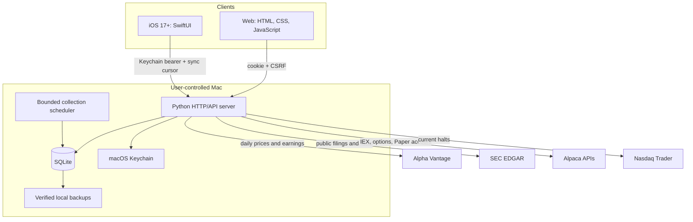

# Architecture

Status: current public reference implementation.

Stock Thesis Ledger is a local modular monolith. One Python process serves the static
Web application and authenticated JSON API, schedules bounded local collection,
and reads and writes a single SQLite database. The native iOS client uses the
same API and sync cursor.

The v0.1.0 runtime UI and compatibility identifiers still use `Investor Lab`;
the public project and repository use `Stock Thesis Ledger`.

## Component map

## Runtime layers

### HTTP and authentication

`app.py` uses Python's `ThreadingHTTPServer`. Public routes are limited to
health, login/registration, and static design assets. Authenticated browser
mutations require a CSRF token. iOS uses a bearer session bound to a registered
device.

The first local account claims any supported legacy local records. Registration
then closes by default. Sessions are stored as SHA-256 token hashes and can be
revoked per device.

### Domain and analysis

Research and planning logic is deterministic and runs in the local process.
Market-data quality gates run before a current decision is actionable.
Strategy versions, inputs, evidence, invalidation rules, scenario levels, and
outcomes are retained so a result can be inspected later.

The same domain layer supports:

- watchlist and company research;
- paper portfolio and journal;
- strategy scoring and walk-forward scenarios;
- options payoff and chain analysis;
- day-trade risk planning and replay; and
- Alpaca Paper account and order workflows.

### Persistence

SQLite is the system of record for local accounts, append-only ledgers,
strategy versions, provider caches, and sync events. Forward-only migrations
run at startup. JSON account export excludes password hashes, session tokens,
and provider keys.

Verified backups are written under the ignored `data/backups/` directory.
Restore requires a schema-compatible backup, exact typed confirmation, and a
pre-restore safety copy.

### Sync

Web and iOS request a snapshot and then advance through user-scoped sync
revisions. The server owns calculations and mutation validation, preventing
clients from implementing different financial rules. Large price-bar arrays are
fetched by dedicated routes rather than included in every sync payload.

### Provider adapters

Provider calls are optional and cached:

- Alpha Vantage supplies daily observations and earnings dates.
- SEC EDGAR supplies public submissions, company facts, and filing documents.
- Alpaca supplies IEX market observations, indicative option snapshots, and a
  Paper account/order API.
- Nasdaq Trader supplies current halt observations.

Credential-bearing requests originate only from the server. Tests replace
network access with local fakes.

## Safety invariants

1. There is no live brokerage base URL or real-money order path.
2. Paper mutations require explicit enablement, acknowledgements, idempotent
   client IDs, and local notional/loss checks.
3. Missing, stale, or invalid evidence must remain visible and non-actionable.
4. Browser and iOS session material stays in its platform-appropriate secure
   storage.
5. Provider keys never enter SQLite, sync events, account exports, or client
   responses.
6. Machine-specific paths, tunnel URLs, databases, logs, and signing identities
   stay outside source control.

## Extension boundary

The reference server is appropriate for local use and controlled testing. A
public multi-user service needs a production application boundary rather than
simply binding this process to the internet. At minimum, introduce:

- a hardened HTTPS reverse proxy or managed gateway;
- a production identity, recovery, and verification system;
- per-user authorization tests and request/abuse limits;
- central secret storage and rotation;
- encrypted, remote, restore-tested backups;
- audit and availability monitoring;
- licensed market-data distribution; and
- independent security, privacy, and legal review.

Keep those production concerns modular. Do not split the local calculation
engine into services until an independently scalable or regulated boundary
actually requires it.
