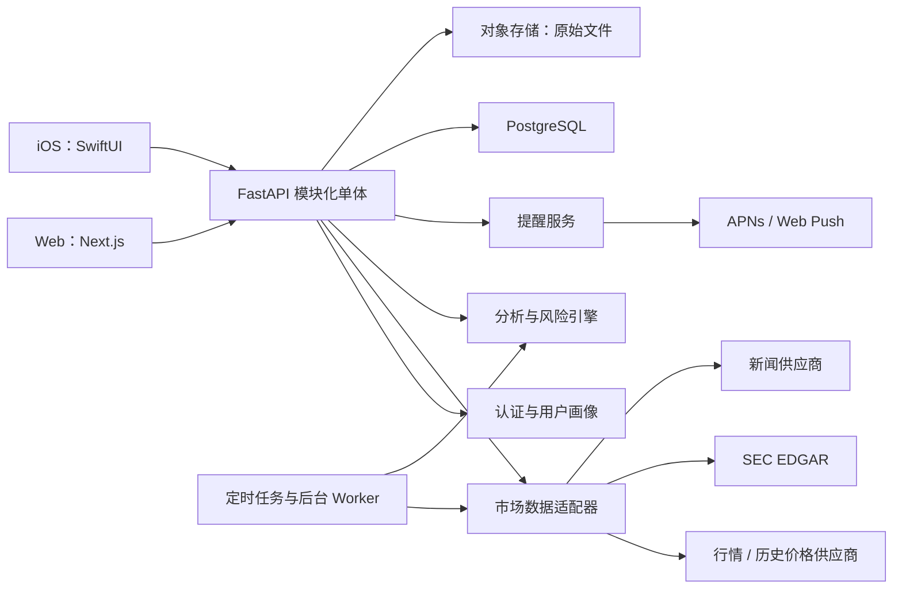
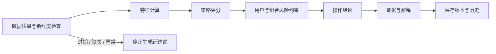

# 股票投资分析软件产品与技术架构

> Historical planning note: this Chinese document preserves an earlier
> production-scale product architecture proposal. It is not the implementation
> map for the current repository. See [Architecture](architecture.md) for the
> shipped local Python/SQLite, static Web, and SwiftUI design.

## 1. 产品定位

当前本地个人版已经实现 Strategy Lab 2.0：Alpha Vantage 日线缓存、SEC
EDGAR 年度 XBRL 基本面与申报日期、五种策略和三种持仓周期的差异化
0-100 权重、持仓/未持仓不同结论、模型版本与变化历史、含双边 10 bps
成本和时间点安全 SEC 数据的 walk-forward 回测，以及 Web/iOS 同步和
可选定时刷新。公司行动、实时日内、实时期权链和券商连接仍属于后续数据阶段。

第一版定位为“美股研究与决策辅助工具”，服务有明确投资周期、风险承受能力和持仓约束的个人投资者。

产品给出可解释的 `买入 / 观察 / 持有 / 减仓 / 卖出` 分析结论，但第一版不自动下单。每条结论必须同时展示：

- 适用对象和投资周期
- 数据截至时间与行情类型（实时或延迟）
- 核心证据与反向风险
- 建议价格区间或触发条件
- 结论失效条件
- 模型版本和上次变化原因

默认假设：先支持美国股票和 ETF；中国 A 股、港股、期权、加密货币和自动交易不进入 MVP。

## 2. MVP 用户流程

1. 用户完成风险、投资周期、收益目标、最大可接受回撤和策略偏好问卷。
2. 用户创建自选股，并手工录入或通过 CSV 导入持仓。
3. 系统拉取行情、财务数据、SEC 文件和相关新闻。
4. 分析引擎生成股票评分、适配度、风险和操作结论。
5. 用户查看证据、风险、估值区间及结论变化历史。
6. 价格、财报、风险或结论发生重要变化时，Web 与 iOS 收到提醒。

## 3. 总体架构

### 技术选型

| 层 | MVP 选择 | 原因 |
|---|---|---|
| Web | Next.js + TypeScript | 适合桌面研究页面、表格、SEO 和响应式布局 |
| iOS | SwiftUI + async/await | 原生图表、通知、Keychain 和流畅移动体验 |
| API | Python FastAPI + Pydantic + SQLAlchemy | 金融计算生态成熟，并可自动生成 OpenAPI 客户端 |
| 数据库 | 托管 PostgreSQL | 一个数据库覆盖账户、持仓、行情和建议历史 |
| 文件 | S3 兼容对象存储 | 保存 SEC 原文、原始供应商响应和导出文件 |
| 后台任务 | 一个独立 Worker + 托管定时器 | 先不引入 Kafka；任务量增加后再加 Redis/队列 |
| 部署 | Web 静态/边缘平台 + 容器化 API/Worker + 托管数据库 | 独立扩容但不拆微服务 |
| 接口 | REST + 行情 WebSocket | REST 负责业务，WebSocket 只负责用户正在看的报价 |

后端保持一个代码库、一个部署单元中的清晰模块边界：`auth`、`market_data`、`research`、`portfolio`、`analysis`、`recommendations`、`alerts`、`audit`。只有某模块出现独立扩容或合规隔离需求时才拆服务。

## 4. 数据架构

### 数据来源

- 行情和 K 线：MVP 只接一个合法授权的市场数据供应商；例如 Alpaca Market Data 提供股票 WebSocket 与历史行情。正式上线前确认套餐是否允许在面向用户的产品中展示和再分发。
- 公司财务和公告：SEC EDGAR `submissions` 与 XBRL `companyfacts` API；原始响应先落对象存储，再标准化入库。
- 公司行动：拆股、分红、并购和 ticker 变更必须进入价格与持仓计算。
- 新闻：选择允许商业展示的供应商；保存来源、发布时间、抓取时间和原文链接。
- 宏观数据：第二阶段再接 FRED 等来源，MVP 只保留接口位置。

### 核心表

- `users`, `investor_profiles`, `strategy_preferences`
- `securities`, `corporate_actions`
- `quotes`, `price_bars`, `fundamental_facts`, `filings`, `news_items`
- `portfolios`, `positions`, `transactions`
- `feature_snapshots`, `analysis_runs`, `recommendations`, `recommendation_evidence`
- `alerts`, `notification_deliveries`
- `model_versions`, `audit_events`, `ingestion_runs`

所有会影响结论的数据记录都包含 `source`、`observed_at`、`as_of`、`ingested_at`。建议记录引用不可变的 `feature_snapshot_id` 和 `model_version_id`，确保以后可以重放。

## 5. 分析与建议引擎

### 第一版评分维度

- 基本面质量：营收、利润、现金流、负债、ROIC、利润率趋势
- 估值：P/E、EV/EBITDA、FCF yield，并与自身历史和同行比较
- 趋势与动量：价格趋势、相对强弱、波动率和成交量
- 事件：财报日期、业绩指引、重大 8-K、分红和公司行动
- 风险：回撤、波动、流动性、财务杠杆、行业集中度和持仓相关性
- 用户适配：投资周期、最大回撤、策略偏好、现有仓位和集中度上限

### 结论规则

- 先计算与用户无关的股票事实和策略评分，再应用用户风险约束。
- `买入` 需要质量、估值/趋势和风险三个门槛同时通过，不能只靠单一指标。
- `卖出` 必须区分基本面恶化、估值过热、趋势破坏、组合超配和用户目标变化。
- 数据过期、关键字段缺失或发生未处理公司行动时，不生成新结论，继续展示上一条并明确标记过期。
- 生成式 AI 只将已经结构化的证据改写为易懂说明；不得创建价格、指标、目标价或买卖动作。

### 质量验证

- 使用滚动/走步回测，严格防止未来数据泄漏和幸存者偏差。
- 与简单基准比较：买入并持有、标普 500、等权组合。
- 同时报告收益、最大回撤、波动、换手、交易成本后的收益和样本数量。
- 为建议引擎保留一组固定场景测试：缺失数据、拆股、极端波动、财报前后、超配持仓。
- 上线前先运行纸面组合；建议质量和数据稳定性达标后再考虑券商交易接口。

## 6. 功能优先级

### P0：首个可用版本

- 注册登录、账户删除、隐私同意和设备管理
- 投资者画像与可编辑策略偏好
- 股票搜索、自选股、报价、K 线和数据新鲜度标签
- 股票详情：公司、财务趋势、估值、事件、新闻和风险
- 手工/CSV 持仓，组合盈亏、集中度和风险概览
- 个股与持仓的可解释操作结论
- 建议历史和“为什么发生变化”
- 价格、财报、风险和建议变化提醒
- 管理后台：数据延迟、采集失败、异常报价和模型版本
- Web 响应式页面与原生 iOS 核心页面

### P1：验证留存后增加

- 券商只读同步，不下单
- 自定义指标权重和多个策略模板
- 组合情景分析、相关性、再平衡建议和税务批次
- 财报原文问答，答案必须引用具体 SEC 文件
- 观察清单筛选器和策略回测器
- 小组件、Live Activities 或 Apple Watch 只在提醒使用率证明有需求后考虑

### P2：合规和商业模式成立后增加

- 纸面交易
- 经法律审查后的券商下单与订单状态同步
- 顾问/家庭账户、多账户权限和报告
- A 股、港股及更多资产类别
- 机器学习排序；只有在积累足够无泄漏的历史样本后启用

### 明确不做

- MVP 不做微服务、Kafka、数据湖或 Kubernetes。
- MVP 不训练预测股价的自有大模型。
- MVP 不自动下单，不承诺收益，不使用“稳赚”式文案。
- MVP 不同时连接多个相同用途的数据供应商；先做好一个适配器和故障降级。

## 7. 双端信息架构

### Web

- 首页：组合健康度、今日变化、待处理提醒和自选股
- 股票详情：图表、结论、证据、财务、估值、事件和历史
- 组合：持仓、行业/个股暴露、风险、操作清单
- 筛选器：按策略和风险筛选股票
- 设置：画像、策略、提醒、数据和隐私

### iOS

- `今日`：只展示最重要的组合变化和建议变化
- `自选`：实时/延迟报价和提醒状态
- `股票`：移动端压缩版分析卡与可展开证据
- `组合`：仓位、盈亏、集中度和风险
- `设置`：画像、通知、隐私和账户

Web 承担深度研究和配置；iOS 承担日常检查、提醒和快速阅读。两端共享 OpenAPI 协议和业务规则，不强行共享 UI 代码。

## 8. API 草案

- `GET /v1/securities/search?q=`
- `GET /v1/securities/{symbol}/overview`
- `GET /v1/securities/{symbol}/bars`
- `GET /v1/securities/{symbol}/analysis?profile_id=`
- `GET /v1/recommendations` 与 `GET /v1/recommendations/{id}`
- `POST /v1/portfolios`、`POST /v1/portfolios/{id}/transactions`
- `POST /v1/portfolios/{id}/imports`
- `POST /v1/alerts` 与 `PATCH /v1/alerts/{id}`
- `GET/PATCH /v1/investor-profile`
- `WS /v1/quotes?symbols=AAPL,MSFT`

所有写接口使用幂等键；所有建议响应包含 `as_of`、`market_session`、`data_freshness`、`model_version` 和 `evidence`。

## 9. 安全、隐私与合规

- 行情供应商密钥、SEC 抓取标识和券商 token 只存服务端；iOS 凭证存 Keychain。
- 全链路 TLS，数据库和备份加密，最小权限，管理员操作审计。
- 删除账户时删除或匿名化个人数据；保留记录的范围和期限由合规政策决定。
- 把个人画像用于个性化买卖建议，可能触及投资顾问监管。免责声明本身不能代替牌照、披露、适当性和合规义务，开发前需由熟悉目标市场的律师确认产品边界。
- Apple 对投资、交易或资金管理 App 的主体、许可和权限有明确要求。计划以法律实体加入 Apple Developer Program，并在提交前准备数据授权、服务条款、隐私政策及审核说明。
- 产品必须公开模型假设、局限、利益冲突、数据延迟和历史表现计算方法。

## 10. 非功能指标

- 行情延迟必须显式显示；断流后自动退化为最近快照并标记时间。
- 任何建议页面都不能在拿不到关键证据时显示“最新建议”。
- 关键 API 目标为 p95 小于 500 ms（不含首次外部数据回源）。
- 后台监控至少覆盖行情断流、数据缺口、公司行动遗漏、任务失败、通知失败和建议数量异常。
- 每日数据库备份；上线前完成恢复演练。
- 无障碍：动态字体、VoiceOver、色彩之外的涨跌表达和足够对比度。

## 11. 实施路线图

### Phase 0：1-2 周，产品和合规验证

- 确认首发国家、用户类型、是否收费以及是否构成个性化投资建议。
- 签订行情和新闻展示/再分发权限。
- 固定 3 个投资策略、建议字段和回测验收标准。
- 制作 Web 与 iOS 可点击原型并完成 5-8 位目标用户访谈。

### Phase 1：3-4 周，数据与分析核心

- 建立 FastAPI、PostgreSQL、认证、行情/SEC 采集和数据质量检查。
- 实现投资者画像、持仓、第一版可复算评分和建议历史。
- 建立回测、固定场景测试、数据新鲜度和采集监控。

### Phase 2：3-4 周，Web MVP

- 完成首页、股票详情、组合、自选、建议和设置。
- 完成 CSV 导入、提醒和管理数据健康页。
- 内部纸面组合连续运行至少 2-4 周。

### Phase 3：3-4 周，iOS MVP

- 使用同一 OpenAPI 完成 Today、自选、股票、组合和设置。
- 接入 APNs、Keychain、账户删除、无障碍和 TestFlight。
- 完成 App Store 合规材料与审核说明。

### Phase 4：2 周，封闭测试与上线

- 修正数据边界和建议解释问题，完成安全、恢复和负载验证。
- 小范围邀请测试，监控数据新鲜度、建议变动率、7/30 日留存和提醒打开率。
- 先上线研究与纸面决策；交易能力保持关闭。

小团队可在约 12-16 周完成首个封闭测试版；单人开发更现实的周期是 4-6 个月。

## 12. 上线前决策清单

1. 首发只做美股，还是必须支持 A 股/港股？
2. 产品是通用研究工具，还是根据个人情况提供个性化建议？
3. 采用订阅制、一次性收费，还是免费验证？
4. 行情需要全市场实时，还是 MVP 可接受 IEX/延迟 SIP 并清楚标注？
5. 首批策略选择价值、质量成长、趋势、股息中的哪三个？
6. 是否已有法律实体、隐私政策负责人和金融合规律师？

## 参考资料

- SEC EDGAR APIs: https://www.sec.gov/search-filings/edgar-application-programming-interfaces
- SEC Robo-Advisers Guidance: https://www.sec.gov/investment/im-guidance-2017-02.pdf
- Apple App Review Guidelines: https://developer.apple.com/app-store/review/guidelines/
- Alpaca Real-time Stock Data: https://docs.alpaca.markets/docs/real-time-stock-pricing-data
